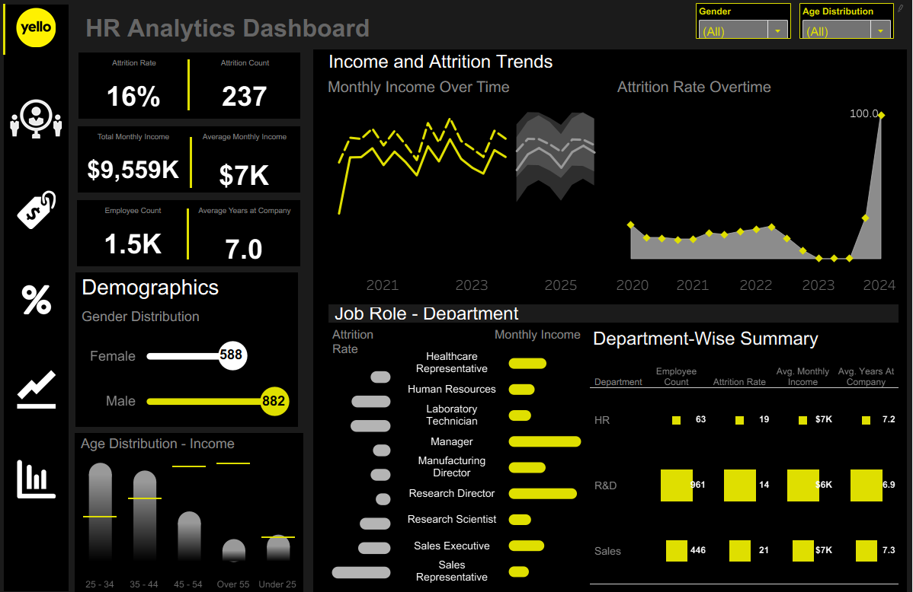
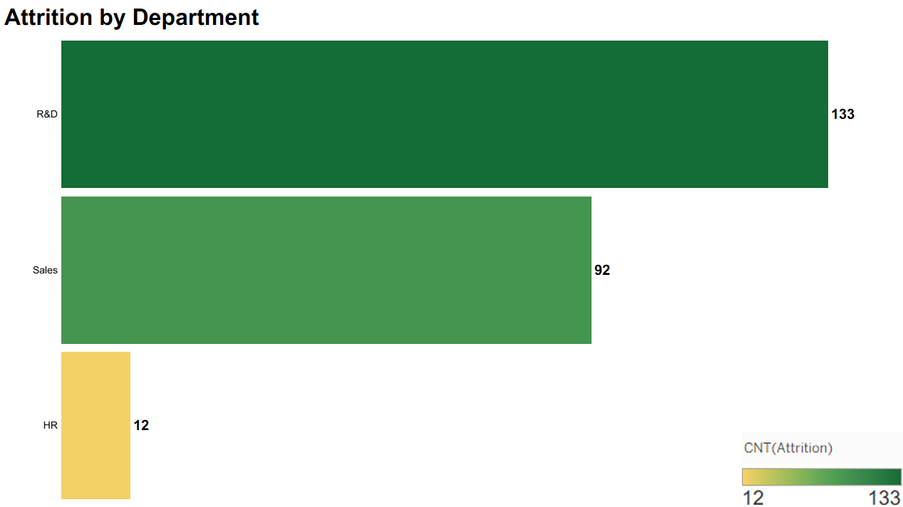
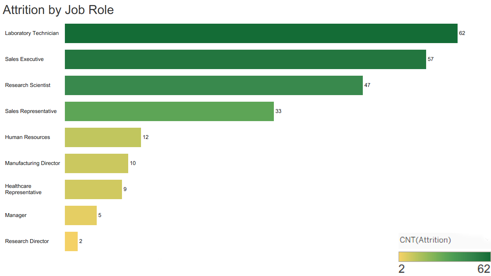
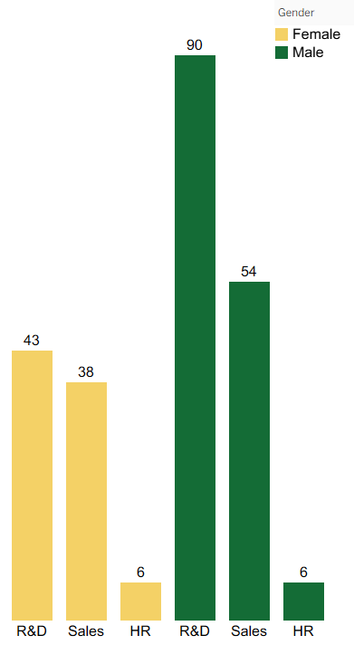
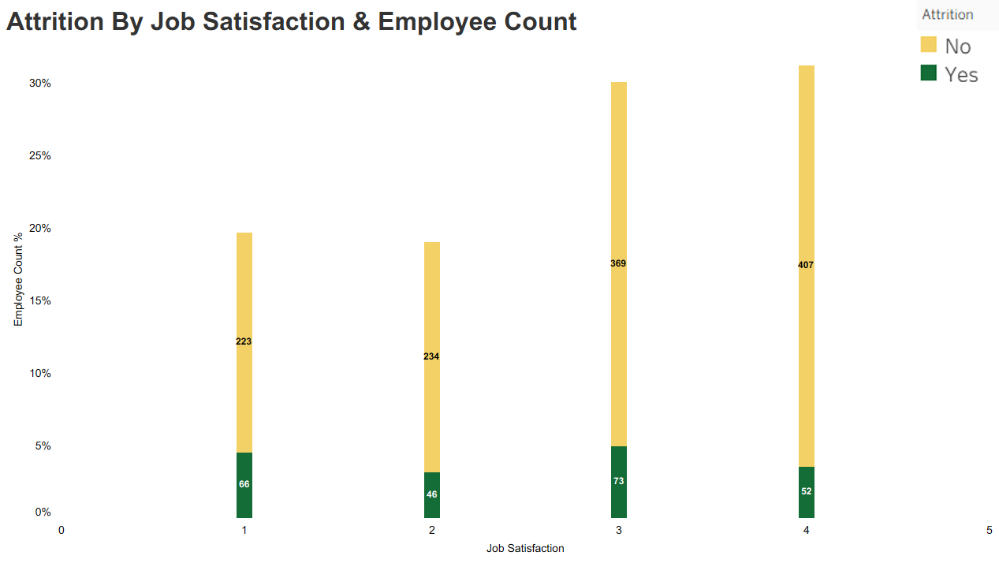
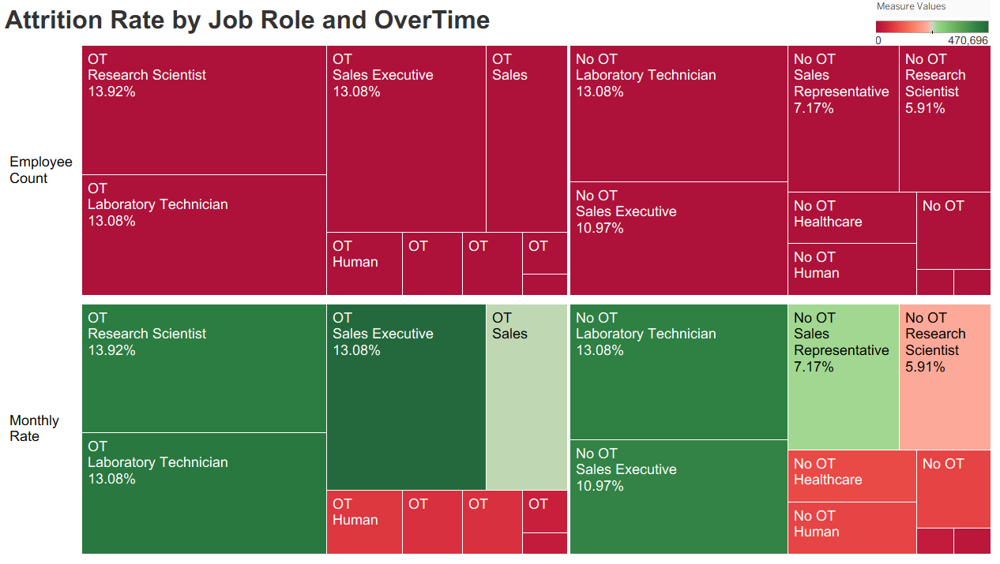
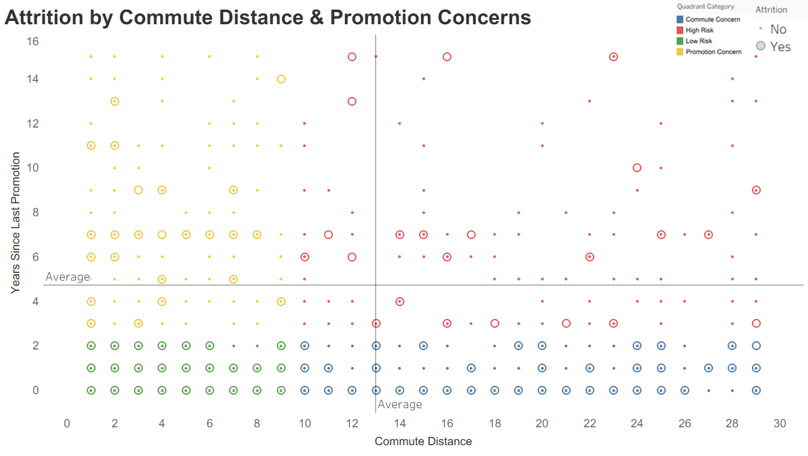
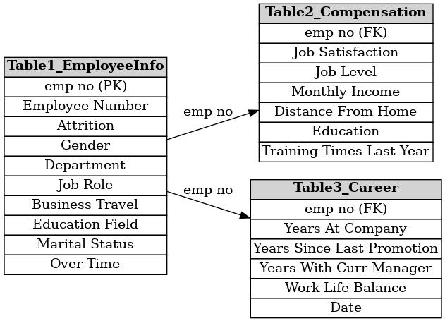

# hr-analytics-dashboard

Tableau HR analytics dashboard with attrition forecasting and demographic insights using a data sample from Yello.

## Executive Summary

This HR analytics project explores key trends in employee attrition using Tableau visualizations, focusing on departments, job roles, satisfaction levels, gender, commute distance, and promotion timing. Through detailed visualizations and statistical insights, this dashboard helps identify key drivers of employee turnover. Departments like R&D and Sales show the highest attrition. Roles with the most stress or unclear career paths, like Laboratory Technicians and Sales Executives, appear most at risk. Additional risk factors include long commutes and long gaps since the last promotion. Visual patterns highlight clear action points: improving job satisfaction, supporting promotions, and analyzing departmental workloads.

## About the Company

Yello is a mid-sized company with a diverse workforce across departments like Sales, Research & Development (R&D), and Human Resources.  
Employees vary in roles, educational backgrounds, and career paths.

To support effective strategic planning, Yello aims to analyze salary trends, workforce demographics, and retention patterns.  
By leveraging data-driven insights, the company seeks to improve decisions related to compensation, training, and employee retention.

## Problem Statement

Yello requires an in-depth analysis of employee attrition trends and workforce demographics to enhance financial planning and retention strategies.

Key challenges include:
- Identifying at-risk employee segments
- Predicting where attrition will spike
- Understanding the impact of commute, promotions, satisfaction, and role type

## Aims of the Project

- Forecast attrition trends using Tableau
- Identify KPIs such as attrition rate and employee count
- Analyze patterns across departments, roles, and demographic factors
- Recommend actionable HR strategies to reduce attrition

## Charts & Deep Dive Analysis

### **Attrition by Department**

**What It Shows**  
Horizontal bar chart showing count of employees who left the company by department.

**Key Observations**  
- R&D has the highest attrition count (133), followed by Sales (92).
- HR sees the lowest attrition (12).

**Interpretation**  
High attrition in R&D and Sales may point to job stress, high demand roles, or lack of growth opportunities.

**Recommendations**  
- Conduct engagement surveys in R&D and Sales.
- Enhance internal mobility and mentorship in those teams.

---

### **Attrition by Job Role**

**What It Shows**  
Employee attrition counts split across job titles.

**Key Observations**  
- Laboratory Technicians (62) and Sales Executives (57) have the highest attrition.
- Directors and Managers show minimal attrition.

**Interpretation**  
Support and entry-level roles are most affected, potentially due to burnout or lack of progression.

**Recommendations**  
- Review workloads and provide growth plans for junior staff.
- Encourage development programs for technical and sales staff.

---

### **Attrition by Gender and Department**

**What It Shows**  
Clustered bar chart showing gender distribution in attrition by department.

**Key Observations**  
- R&D shows highest male attrition (90), while female attrition is balanced across R&D and Sales.

**Interpretation**  
Gendered attrition patterns could reflect different experiences across roles or promotion equity.

**Recommendations**  
- Conduct department-level gender equity assessments.
- Explore flexible work arrangements and mentorship.

---

### **Attrition by Job Satisfaction and Employee Count**

**What It Shows**  
Stacked bar chart showing attrition rate by employee job satisfaction scores.

**Key Observations**  
- Job satisfaction level 1 has the highest attrition (66).
- Surprisingly, some attrition persists even at level 4.

**Interpretation**  
Low satisfaction directly correlates with high turnover. But satisfaction alone doesn't eliminate risk.

**Recommendations**  
- Implement regular satisfaction surveys.
- Pair engagement scores with workload analysis for context.

---

### **Attrition Rate by Job Role and Overtime**

**What It Shows**  
Treemap showing attrition rate split by job role and overtime status.

**Key Observations**  
- Overtime workers across all roles show higher attrition.
- Research Scientists and Lab Techs show the highest rates under OT.

**Interpretation**  
Excessive overtime may be a major driver of attrition.

**Recommendations**  
- Set OT thresholds by role and department.
- Consider scheduling or team structure changes to reduce dependency on OT.

---

### **Attrition by Commute Distance and Promotion Concerns**

**What It Shows**  
Scatterplot using quadrant categories for commute distance and years since promotion.

**Key Observations**  
- Most attrition occurs in the top-right "High Risk" quadrant.
- Employees with long commutes and no recent promotion are more likely to quit.

**Interpretation**  
Promotion delays and long commutes are a compounded retention issue.

**Recommendations**  
- Offer remote/flexible roles to employees with long commutes.
- Build transparent promotion cycles and fast-track programs.

---

## Assumptions & Limitations

- The data reflects a static snapshot; time series trends may provide more insight.
- Promotion timelines, commute preferences, and job satisfaction are self-reported or derived.
- External labor market trends are not factored into the attrition modeling.

## Future Opportunities

- Integrate exit survey data for sentiment analysis.
- Build predictive ML models using logistic regression or decision trees.
- Benchmark attrition rates against industry averages.

## Files Included

| File Name                                     | Description                                  |
|----------------------------------------------|----------------------------------------------|
| HR_Analytics_Dashboard.twbx                   | Packaged Tableau Workbook with full dashboard |
| HR_Data_Cleaned_Table_1.xlsx                  | Cleaned Excel data source (Table 1)           |
| HR_Data_Cleaned_Table_2.xlsx                  | Cleaned Excel data source (Table 2)           |
| HR_Data_Cleaned_Table_3.xlsx                  | Cleaned Excel data source (Table 3)           |
| attritionbydepartment.png                    | Chart 1: Attrition by Department             |
| attritionbyjobrole.png                       | Chart 2: Attrition by Job Role               |
| attritionbygenderanddepartment.png           | Chart 3: Attrition by Gender & Department    |
| attritionbyjobsatisfactionandemployeecount.png| Chart 4: Attrition by Job Satisfaction       |
| attritionratebyjobroleandovertime.png        | Chart 5: Attrition by Job Role & Overtime    |
| attritionbycommuteandpromotion.png           | Chart 6: Commute & Promotion Attrition       |
| Dashboard_Screenshot.png                     | Dashboard visual summary                     |
| README.md                                     | This documentation file                      |

**About the Data**

This HR dataset is derived from cleaned and joined records across three tables. The combined data includes employee demographics, job satisfaction, compensation, tenure, and work-life balance attributes. It enables multi-dimensional analysis of attrition drivers and workforce dynamics.

The schema used for this analysis was not sourced from a SQL database, but a simulated join across three Excel files. The image below represents the logical structure in the form of an Entity Relationship Diagram (ERD):

**Recommendations**

- Strengthen retention strategies in high-risk departments such as Sales and R&D.
- Investigate causes of low job satisfaction among specific job roles and demographics.
- Consider targeted employee development in job levels with high attrition and lower satisfaction.
- Expand data inputs with exit interview responses, manager feedback, and external benchmarks for richer predictive models.

  ## Disclaimer

This project is for portfolio and educational display only.  
No content may be copied, reproduced, or reused without permission.

**Connect With Me**

- LinkedIn: [linkedin.com/in/desireesalvant](https://linkedin.com/in/desireesalvant)
- GitHub: [github.com/DesireeSalvant](https://github.com/DesireeSalvant)
- Portfolio: [desireesalvant.com](https://desireesalvant.com)
- Tableau Public: [View My Tableau Projects](https://public.tableau.com/app/profile/desiree.salvant)
